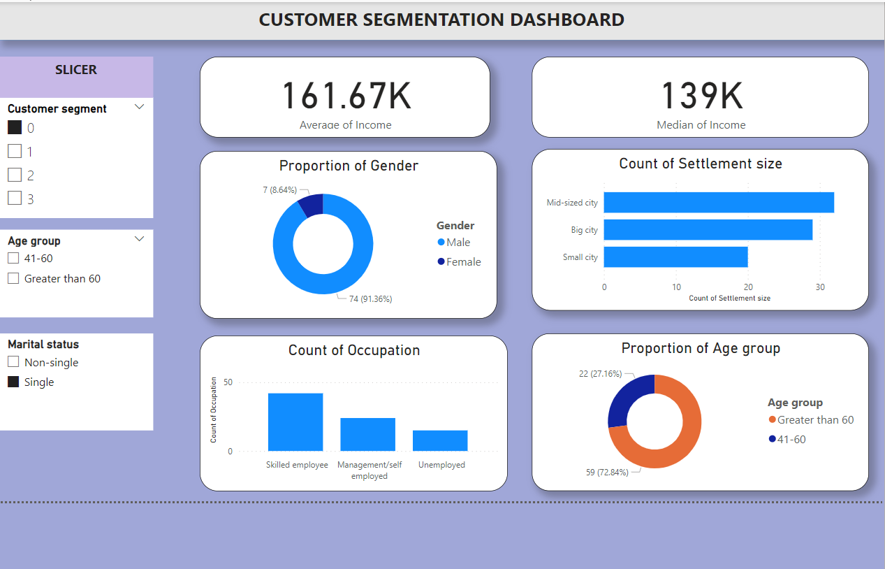

# Customer-segmentation-Analysis
This project is a customer segmentation analysis of customers of an FMCG store. The goal of the project is to create clusters or groups of these customers to foster marketing decisions and for better undertsanding of customer characteristics which could ultimately impact sales and profit generation.

# Table Of Contents
* [Installation](https://github.com/Jess607/Customer-segmentation-Analysis#installation)
* [About the Project](https://github.com/Jess607/Customer-segmentation-Analysis#about-the-project)
* [Data Gathering](https://github.com/Jess607/Customer-segmentation-Analysis#data-gathering)
* [File Description](https://github.com/Jess607/Customer-segmentation-Analysis#file-description)
* [Licensing And Authors](https://github.com/Jess607/Customer-segmentation-Analysis#licensing-and-authors)

# Installation 
The code requires:
* `python 3 and above`
* `pandas`
* `sklearn`
* `powerbi desktop` for visualization purposes 

# About The Project 
Clustering analysis is perhaps the most popular aspect of unsupervised machine learning aimed at grouping features into clusters that can be further explored. In the words of  Yann LeCun  “if intelligence was a cake, unsupervised learning would be the cake, supervised learning would be the icing on the cake, and reinforcement learning would be the cherry on the cake”. This empahasizes the power wielded by unsupervised-cluster algorithms. 

In business intelligence, it is often useful to create groups of customers or consumers of products for various purposes be it for marketing, creating recommendation systems or just plainly for data analysis. Cluster analysis have shown great potential at meeting the needs of businesses when it comes to carrying out these customer segmentation processes. 

In this project, we applied the k means clustering algorithm to a 2000 instance unlabeled dataset, creating 4 distinct customer segments based on 7 faetures gathered. The k means algorithm has become a popular choice for creating clustering models because of its intuitive and simple approach at solving the problem. Upon creating these segments, we went ahead to create an interactive dashboard to analyse how each customer segment is different from the rest based on the features gathered. An example would be how the average income of one customer segment is different from the next and vice versa. PowerBI's interactive features through the addition of slcers created an easy avenue to carry out this task.

# Data Gathering 
Data was gathered from kaggle's amazing repository of datasets available for use.

# File Description 
The folder contains:
* `a data folder` that contains the original dataset and that generated after creating the clustering model that served as an input for the powerbi dashboard
* `customer.ipynb` a jupyter notebook of the clustering model creation 
* `customer_segment.pbix` the powerbi dashboard created- this should be opened with powerbi desktop

# Licensing And Authors
This code was created by Jessica Ogwu under the GPL-3.0 license. Please feel free to use the resources as you deem fit.
